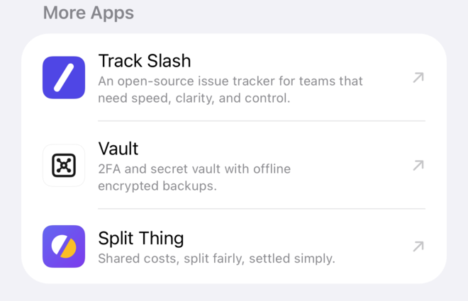

# bad-bundle-apps

A Swift package that lists Bad Bundle's apps the way [badbundle.com](https://badbundle.com/apps/) does, with their icons and a list row that opens each app's page, so the apps can point people at each other.



## Use

```swift
.package(url: "https://github.com/badbundle/bad-bundle-apps", exact: "0.1.0")
```

```swift
import BadBundleApps

Section("More Apps") {
    ForEach(BadBundleApp.all(except: .gps)) { app in
        BadBundleAppLink(app)
    }
}
```

- `BadBundleApp`: an app's name, its tagline from the site, and the URL of its page on badbundle.com. `BadBundleApp.all` lists every app in the site's order, and `all(except:)` leaves one out, so an app can list the others.
- `BadBundleAppIcon`: the app's icon, cut to the Home Screen's rounded square. It fills the frame it's given.
- `BadBundleAppLink`: a `List` or `Form` row with the icon, name and tagline, which opens the app's page. The section around it is left to the app.

iOS 17 and macOS 14 or later. There are no dependencies.

## Adding an app

Once an app has a page on badbundle.com (`content/apps/<slug>/_index.md` in bad-bundle-web):

1. Add its icon to `Sources/BadBundleApps/Icons.xcassets` as `<slug>.imageset`: a 512 px square PNG, full bleed, without rounded corners. `BadBundleAppIcon` draws the corners, so every icon gets the same shape.
2. Add a `static let` to `BadBundleApp.swift` with the slug, the page's title and its `tagline`, copied word for word, and put it in `all` in the order of the pages' `weight`.
3. Run `swift test`, tag a new version and move the apps on to it.

The icons came from: Track Slash and Split Thing, their repos' `icon.svg` with the corner radius taken out; Vault, its app icon (`AppIcon-Light.png`); GPS, badbundle.com's `GPSLogo-512.jpeg`.

## Licence

The code is under the MIT licence (see [LICENSE](LICENSE)). The app names and icons identify Bad Bundle Limited's apps and aren't licensed for any other use.
